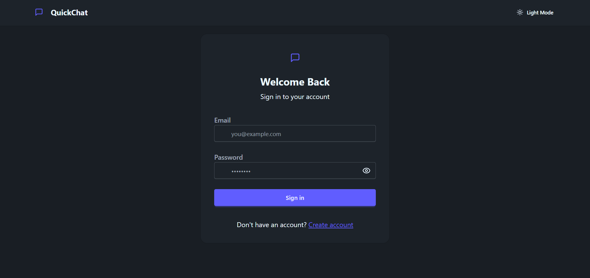
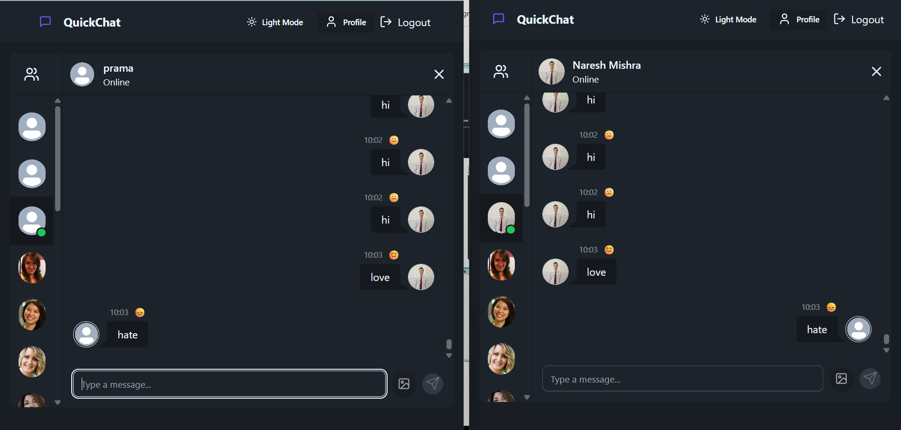

Real-Time Chat Application with Sentiment Analysis

[VIDEO DEMO](https://drive.google.com/file/d/1Pg9qOdARKAHiNJg84fIkBvtWRkUHNFAk/view?usp=drivesdk)
[FIGMA UI DESIGN](https://www.figma.com/design/UPnVdhko3Lagl01Qo08tEI/RealTimeChatApp?node-id=0-1&p=f&t=AP4jgmOSOZxIEf8z-0)
[WIREFRAME](https://www.figma.com/design/6Rztawzah3UokZEy9gjvln/wireframes?node-id=0-1&p=f&t=4tanRcDKYSkw9P7P-0)

A real-time chat application with built-in sentiment analysis using React.js, Socket.IO, MongoDB, and Node-NLP

# LOGIN PAGE

# REAL_TIME_CHAT PAGE 

# Real-Time Chat Application with Sentiment Analysis

A real-time chat application with built-in sentiment analysis using React.js, Socket.io, MongoDB, and Node-NLP.

## Features
1. Realtime messaging with Socket.IO
2. Sentiment analysis (positive, neutral, negative) of text messages
3. JWT Authentication & bcrypt password hashing
4. Responsive UI with Tailwind CSS
5. Image message support
6. Dark/light mode support (optional)

## Tech Stack
1. Frontend: React.js, Tailwind CSS  
2. Backend: Node.js, Express.js, Socket.IO  
3. Sentiment Analysis: (Node NLP)  
4. Database: MongoDB  
5. Authentication: JWT + bcrypt

## Setup .env file
     MONGODB_URI=...
     PORT=5001
     JWT_SECRET=...

     CLOUDINARY_CLOUD_NAME=...
     CLOUDINARY_API_KEY=...
     CLOUDINARY_API_SECRET=...

     NODE_ENV=development

## How to Run
1. Clone the repository
   git clone https://github.com/yourusername/realtimechatAPI.git
2. Change Directory 
      cd realtimechatAPI
3. Setup backend
      cd backend
      npm install
      npm run dev

4. Setup frontend
      cd ../frontend
      npm install
      npm run dev

## Usage
  1. Open your browser at http://localhost:3000 (or the port your frontend runs on)
  2. Register/login and start chatting with real-time sentiment analysis!